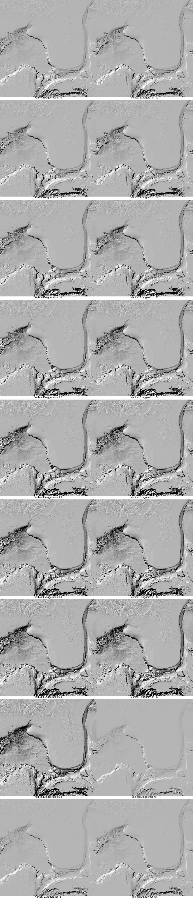
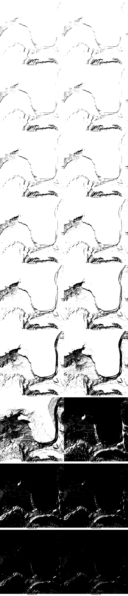
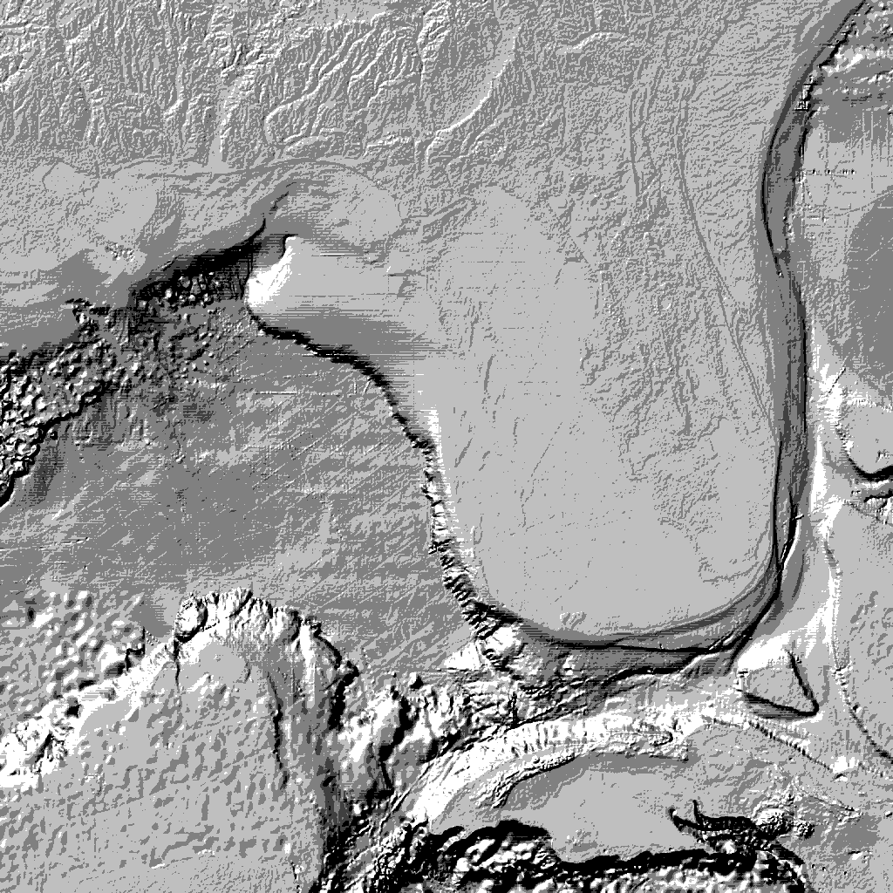
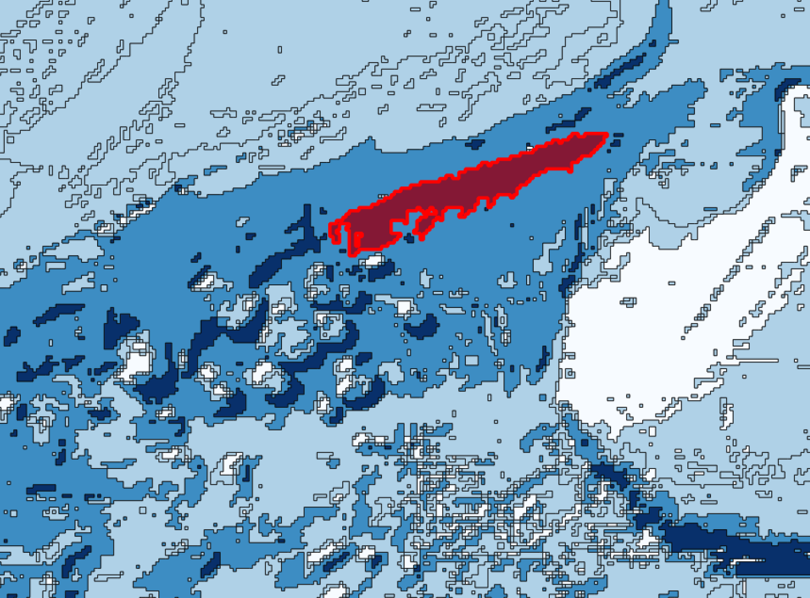

# Generating an Ocean Vector Terrain tile source

Mapbox has an amazing [Mapbox Terrain](https://www.mapbox.com/developers/vector-tiles/mapbox-terrain/) vector tile source.  Unfortunately, the tiles seem devoid of any ocean data, leaving 71% of the earth somewhat barren.  This is an experiment in generating our own set of vector tiles from the [GEBCO](http://www.gebco.net) gridded bathymetric data sets. Much of this is based off of the [Global Vector Terrain slide deck](https://speakerdeck.com/mapbox/global-vector-terrain) presented by @ajashton of Mapbox at NACIS 2014 Practical Cartography Day. While the particular dataset we'll be using isn't especially massive, we'll do our best to design this process to be robust enough to handle much larger quantities of data. This largely translates into breaking the data up and processing it in a distributed fashion, as mentioned in the NACIS slides.

One thing that was not initially clear was how to handle features that span multiple tiles. Should we clip features that span multiple tiles? If so, does the [vector tile spec](https://github.com/mapbox/vector-tile-spec) differentiate between features that are clipped vs features that naturally end at the boundary of the tile? Is only the boundary of the polygon included, or are extra lines at the tile boundary added to "close" the polygon within the tile?  There are multiple issues regarding this topic ([4](https://github.com/mapbox/vector-tile-spec/issues/4), [8](https://github.com/mapbox/vector-tile-spec/issues/8), [26](https://github.com/mapbox/vector-tile-spec/issues/26)), but the best summary for how Mapbox handles this comes from @pramsey's [comment](https://github.com/mapbox/vector-tile-spec/issues/26#issuecomment-63902337):

> It’s a “trick” a “hack” kind of. The tiles are clipped to be slightly *larger* [than] a perfect tile would be, and then when it is render time, the render canvas is set to the *exact* tile size. The result is that edge artifacts end up outside the render frame and the rendered tiles all magically line up. It makes me feel a little dirty (the correct clipping buffer is a bit of a magic number that depends on the rendering rules that are going to be applied later) but it does serve to reinforce that vector tiles in this spec are not meant to be used as a replacement for a real vector feature service (be it a WFS, ac ArcGIS service, or some other web service), but as an improved transport for rendering, first and foremost.

Being that dialing-in the correct clipping buffer will depend on the rendering rules, I think it would be wise to split the generation of vector tiles into two main sections:

1. Vectorize input data and store in a database
1. Render vector tiles and store in cloud

## I. Vectorize & Store

### Requirements

* ImageMagick
* GDAL
* libgeotiff
* Postgresql
* PostGIS

### General Steps

1. Get the data
1. Downsample data
1. Subset Data (for dev)
1. Hillshade data
1. Convert to Monochrome Levels
1. Polygonize / Load into DB

### 1. Sourcing & Preparing Data

First and foremost, we need some data. As mentioned above, we'll be using a GEBCO dataset. There are multiple offerings, but at the time of writing the highest-resolution data offered by GEBCO is the [GEBCO 30 arc-second grid data](http://www.gebco.net/data_and_products/gridded_bathymetry_data/gebco_30_second_grid/). It is available for download free from their website.

As you'd guess from the name, the GEBCO 30 arc-second dataset stores data in a 30 arc-second (1/120 degree or 1/2 arcminute) grid. Depth is stored in meters.

About arc-second data:

> At the equator, an arc-second of longitude approximately equals an arc-second of latitude, which is 1/60th of a nautical mile (or 101.27 feet or 30.87 meters). Arc-seconds of latitude remain nearly constant, while arc-seconds of longitude decrease in a trigonometric cosine-based fashion as one moves toward the earth's poles. - [_Source: ArcUser Online - Measuring in Arc-Seconds_](http://www.esri.com/news/arcuser/0400/wdside.html)

The data arrives in EPSG:4326 (WGS84). We'll need to get it in EPSG:3857 (for more information on the differences, see [here](http://gis.stackexchange.com/questions/48949/epsg-3857-or-4326-for-googlemaps-openstreetmap-and-leaflet)). Since the file isn't too large (~1.5GB) we can go ahead and convert it before we get started. While we're at it, we may as well convert the data from NetCDF to a geotiff. This will allow us to interact with the data through ImageMagick. As mentioned mention in [Mapbox' Working with GeoTIFFs documentation](https://www.mapbox.com/tilemill/docs/guides/reprojecting-geotiff/) we'll clip the data to web mercator extents. Originally, I had planned on using the [Lanczos](http://gis.stackexchange.com/questions/10931/what-is-lanczos-resampling-useful-for-in-a-spatial-context#answer-14361) resampling method hoping for a higher quality output (as recommended in Mapbox' GeoTIFFs documentation), but found that it exaggerated linear artifacts in the data:


In the end, `bilinear` and `cubic` seemed to produce the most appealing output. I opted to go with `cubic`:

```bash
gdalwarp -s_srs epsg:4326 -t_srs epsg:3857 -of GTIFF -te -20037508.34 -20037508.34 20037508.34 20037508.34 -r cubic data/GEBCO_2014_1D.nc data/GEBCO_2014_1D_3857.tif
```

If the file were drastically larger, it might make sense to reproject after we subset our data. On a 2.4 GHz Intel Core i5 Retina MacbookPro with 8 GB RAM, this operation took around 80 seconds.

### 2. Downsample

From GDAL info, we can see that our image is `29136` x `29136`:

```
$ gdalinfo data/GEBCO_2014_1D_3857.tif
Driver: GTiff/GeoTIFF
Files: data/GEBCO_2014_1D_3857.tif
Size is 29136, 29136
Coordinate System is:
PROJCS["WGS 84 / Pseudo-Mercator",
    GEOGCS["WGS 84",
        DATUM["WGS_1984",
            SPHEROID["WGS 84",6378137,298.257223563,
                AUTHORITY["EPSG","7030"]],
            AUTHORITY["EPSG","6326"]],
        PRIMEM["Greenwich",0],
        UNIT["degree",0.0174532925199433],
        AUTHORITY["EPSG","4326"]],
    PROJECTION["Mercator_1SP"],
    PARAMETER["central_meridian",0],
    PARAMETER["scale_factor",1],
    PARAMETER["false_easting",0],
    PARAMETER["false_northing",0],
    UNIT["metre",1,
        AUTHORITY["EPSG","9001"]],
    EXTENSION["PROJ4","+proj=merc +a=6378137 +b=6378137 +lat_ts=0.0 +lon_0=0.0 +x_0=0.0 +y_0=0 +k=1.0 +units=m +nadgrids=@null +wktext  +no_defs"],
    AUTHORITY["EPSG","3857"]]
Origin = (-20037508.339999999850988,20037508.339999999850988)
Pixel Size = (1375.446755903349867,-1375.446755903349867)
Metadata:
  AREA_OR_POINT=Area
Image Structure Metadata:
  INTERLEAVE=BAND
Corner Coordinates:
Upper Left  (-20037508.340,20037508.340) (180d 0' 0.00"W, 85d 3' 4.06"N)
Lower Left  (-20037508.340,-20037508.340) (180d 0' 0.00"W, 85d 3' 4.06"S)
Upper Right (20037508.340,20037508.340) (180d 0' 0.00"E, 85d 3' 4.06"N)
Lower Right (20037508.340,-20037508.340) (180d 0' 0.00"E, 85d 3' 4.06"S)
Center      (   0.0000000,   0.0000000) (  0d 0' 0.01"E,  0d 0' 0.01"N)
Band 1 Block=29136x1 Type=Int16, ColorInterp=Gray
```

Looking at the following table, we can see that our geotiff is just slightly smaller than the global width of zoom level 7:

Zoom | Global Width (px) | # Tiles Wide
---: | :---: | :---
0 | 256 | 1
1 | 512 | 2
2 | 1024 | 4
3 | 2048 | 8
4 | 4096 | 16
5 | 8192 | 32
6 | 16384 | 64
7 | 32768 | 128
8 | 65536 | 256
9 | 131072 | 512
10 | 262144 | 1024
11 | 524288 | 2048
12 | 1048576 | 4096
13 | 2097152 | 8192
14 | 4194304 | 16384
15 | 8388608 | 32768
16 | 16777216 | 65536
17 | 33554432 | 131072
18 | 67108864 | 262144
19 | 134217728 | 524288

_TODO: Fill in the downsampling portion_


### 3. Subset Data

To break the dataset up into separate 1024px x 1024px slices to be processed by different workers, we'll need to subset the data. This is a pretty straightforward operation:

```bash
gdal_translate -srcwin 7200 11800 1024 1024 -of GTIFF data/GEBCO_2014_1D_3857_cropped.tif output/subset.tif
```

For the purpose of dialing in other commands, we'll experiment with a slice of the Florida / Gulf of Mexico area. This area provides a variety of surface types to visualize.

#### Optional: Remove terrain data

Mapbox already offers a great set of terrain data. You may not be looking to replace that, only to add missing ocean data. To remove the terrain data from the GEBCO dataset, we could clip it to only contain ocean data. An option would be to use the [Generalized Coastline dataset](http://openstreetmapdata.com/data/generalized-coastlines) from OSM to achieve this. The OSM Generalized Coastline dataset only goes up to zoom level 8, which actually appears about right for the resolution of the GEBCO 30 arc-second grid. If we were using higher-resolution data, something like the [Water Polygon dataset](http://openstreetmapdata.com/data/water-polygons) would likely be a better fit.

Crop shapefile (takes ~18seconds):
```bash
ogr2ogr -f "ESRI Shapefile" output/cropped_coastline.shp data/water-polygons-generalized-3857/water_polygons_z8.shp -clipsrc 7200 11800 8224 12824
gdalwarp -cutline output/cropped_coastline.shp output/subset.tif output/subset_cropped.tif
```

For the sake of this experiment, we'll encode both the bathymetric and terrain data.


### 4. Hillshade

To produce hillshade data, we will be utilizing the [`gdaldem`](http://www.gdal.org/gdaldem.html) command.

#### A word about scale...

We'll have to adjust the vertical exaggeration as our data moves away from the equator. _TODO: More about this_

Convenience function to help experiment with finding the right hillshade level using GDAL:

``` bash
rm output/subset.tif_hillshade_*

# example usage: hillshade subset.tif 2
hillshade () {
    echo "gdaldem hillshade -co compress=lzw -compute_edges -z $2 $1 $1_hillshade_$2.tif";
    gdaldem hillshade -co compress=lzw -compute_edges -z $2 $1 $1_hillshade_$2.tif;
}
for i in $(seq 02 19);
    do hillshade output/subset.tif $(($i * 2));
done

# Compose montage
unset arguments;
for f in output/subset.tif_hillshade_*; do
    var=${f#*_*_*} var=${var%%.*};
    arguments+=(-label "Vertical Exaggeration: $var" "$f");
done
montage "${arguments[@]}" -tile 2x -geometry 480 imgs/hillshade_montage.jpg

# View output
open imgs/hillshade_montage.jpg
```

Using `-co compress=lzw` and `-compute` to [compress the TIFF and avoid black pixel border around the edge of the image](https://www.mapbox.com/tilemill/docs/guides/terrain-data/#creating-hillshades), respectively.



At first blush, it appears that a vertical exaggeration at `30` best illustrates the elevation model (looking at the inland regions) but notice that much of the coastal region (such as the [Viosca Knoll area](http://soundwaves.usgs.gov/2011/03/DeepF1sm2LG.jpg)) lies within shadows. It is important to ensure that variation amongst features is not obscured. Bringing out subtle variances can be done with well-chosen thresholds during the conversion to monochrome levels.

_Idea: Adjust altitude as zoom level surpasses natural resolution to minimize objects entirely within shade_

### 5. Convert to Monochrome Levels

You're going to want to produce ~4 monochromatic layers representing varying depths. To do so, we'll use ImageMagick's [threshold](http://www.imagemagick.org/script/command-line-options.php#threshold) utility.

#### 5a. Threshold

``` bash
# Set chosen hillshade value
hillshade_val=2;

# Generate monochrome values
monochrome () {
    echo "convert $1 -threshold $2% $1_monochrome_$2.tif";
    convert $1 -threshold $2% $1_monochrome_$2.tif;
}
for i in $(seq 02 19);
    do monochrome output/subset.tif_hillshade_${hillshade_val}.tif $(($i * 5));
done

# Compose montage
unset arguments;
for f in output/subset.tif_hillshade_${hillshade_val}.tif_monochrome_*; do
    var=${f#*_*_*_*_} var=${var%%.*};
    arguments+=(-label "Threshold: $var" "$f");
done
montage "${arguments[@]}" -tile 2x -geometry 480 imgs/monochrome_montage.jpg

# View output
open imgs/monochrome_montage.jpg
```

This command will likely some `Unknown field with tag ...` warnings during runtime. This is due to ImageMagick is not geo-aware. As such, geo fields are not copied to the new images produced. We'll reapply this data later.



I started with an equally distributed range of thresholds (`20 40 60 80`), and fine-tuned from there based on aesthetics. A lot can be gained from spending some time experimenting with varying thresholds. Initially, almost all inland mountains we limited to being only illustrated by their peaks. Eventually, I found that a threshold of `75` illustrated plenty of the inland features.


#### 5b. Merge

To get a visualization of the output, merge the images into a single image:

``` bash
hillshade_val=2;
convert output/subset.tif_hillshade_${hillshade_val}.tif_monochrome_30.tif \
        output/subset.tif_hillshade_${hillshade_val}.tif_monochrome_50.tif \
        output/subset.tif_hillshade_${hillshade_val}.tif_monochrome_70.tif \
        output/subset.tif_hillshade_${hillshade_val}.tif_monochrome_80.tif \
        -evaluate-sequence mean \
        output/subset.tif_hillshade_monochrome_combined.gif
open output/subset.tif_hillshade_monochrome_combined.gif
```



Oddly, this command failed when attempting to create a TIFF. Instead, I created a GIF output (I initially used JPEG, but opted for GIF due to smaller filesize and no-artifacts).


#### 5c. Re-apply geodata

Since ImageMagick stripped the imagery of its geospatial attributes, we'll need to reapply them somehow. Luckily, GDAL knows to look for a matching .tfw if it sees a TIFF that isn’t internally georeferenced. Since we haven't actually changed any spatial information regarding the imagery, we can take the spatial information from the original `subset.tiff` and name it to match the new `subset.tif_hillshade_monochrome_combined.tfw`:

``` bash
listgeo -tfw output/subset.tif
mv output/subset.tfw output/subset.tif_hillshade_monochrome_combined.tfw
gdal_translate output/subset.tif_hillshade_monochrome_combined.gif output/subset.tif_hillshade_monochrome_combined.tif -a_srs EPSG:3857
```


### 6. Polygonize / Load into DB

Simplify to remove pixelization:

``` bash
gdal_polygonize.py output/subset.tif_hillshade_monochrome_combined.tif -f GeoJSON output/subset.tif_hillshade_monochrome_combined.tif_polygons.geojson
```



_Note: Should we then dissolve/aggregate polygons between subsets that share borders? [[1]](http://gis.stackexchange.com/questions/85028/dissolve-aggregate-polygons-with-ogr2ogr-or-gpc)_

#### Tuning DB

We'll want to add some helpers to our DB and to tune our DB to ensure that it's convenient and performant to use.

#####PostGIS Vector Tile Utils

TODO: Document using [postgis-vt-util](https://github.com/mapbox/postgis-vt-util)

```bash
psql -U <username> -d <dbname> -f postgis-vt-util.sql
```

##### Indexing

For more information, see the [GiST Indexes](http://postgis.net/docs/using_postgis_dbmanagement.html#gist_indexes) section of the PostGIS Manual.

```sql
CREATE INDEX ON bathy USING gist (wkb_geometry) WHERE zoom = 1;
CREATE INDEX ON bathy USING gist (wkb_geometry) WHERE zoom = 2;
CREATE INDEX ON bathy USING gist (wkb_geometry) WHERE zoom = 3;
CREATE INDEX ON bathy USING gist (wkb_geometry) WHERE zoom = 4;
CREATE INDEX ON bathy USING gist (wkb_geometry) WHERE zoom = 5;
VACUUM ANALYZE;
```


## II. Generate Tiles

[PostGIS Manual](https://www.mapbox.com/guides/postgis-manual/)
[PostGIS Vector Tile Utils](https://github.com/mapbox/postgis-vt-util)


## Extras:
_TODO: Explain more about gazeteer_
Load [labels](http://www.ngdc.noaa.gov/gazetteer/)

``` bash
export PGCLIENTENCODING=LATIN1
insert () {
    ogr2ogr -t_srs EPSG:3857 -f PostgreSQL PG:dbname=ocean-tiles data/features/features-$1.shp -nln $1-features -lco OVERWRITE=YES $2 $3;
}

insert point
insert multipoint
insert polygon
insert multipolygon -nlt MultiPolygon
insert linestring
insert multilinestring -nlt MultiLineString
```


## Notes

### Resources

[Mapbox: Processing Landsat 8 Using Open-Source Tools](https://www.mapbox.com/blog/processing-landsat-8/)

_Note: Gridded output of images were created with:_

``` bash
montage -label '%f' subset.tif_hillshade_* -tile 2x -geometry '480x320' montage.jpg
```

_Advanced labeling:_

``` bash
unset arguments
for f in subset.tif_hillshade_.0001.tif_monochrome_*; do
    var=${f#*_*_*_*_} var=${var%%.*};
    arguments+=(-label "Threshold: $var" "$f");
done
montage "${arguments[@]}" -tile 2x -geometry 480 ../../imgs/monochrome_montage.jpg
```
